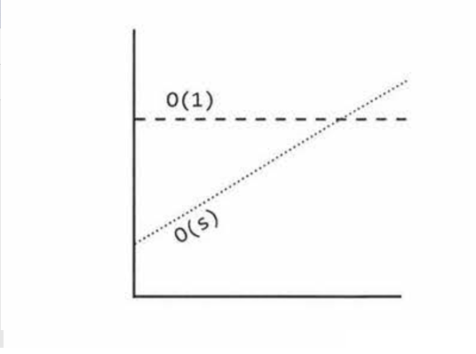
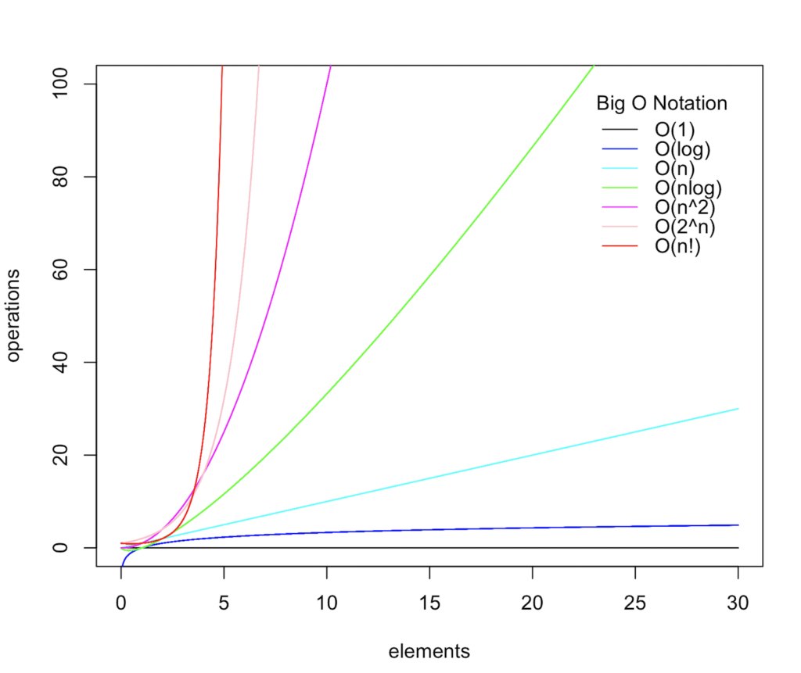

## Big O
#### Time Complexity
- Electronic transfer: O(s), where s is the size of the file, linearly dependent.
- Airplane transfer: O(1), time is constant irrespective of the size of the file.

No matter how big the constant is and how slow the linear increase is, linear will at some point surpass constant. 


Academics use  `big O, big theta, and big omega` to describe runtimes. 
- `Big O` : In academia, `big O` describes an upper bound on the time.
- `Big omega` : In academia, `omega` is the equivalent concept but for lower bound.
- `Big theta` : In academia, theta means both `big O` and `omega`. That is, an algorithm is theta(N) if it is both O(N) and omega(N). `theta` gives a tight bound on runtime.

Industry's meaning of `big O` is closer to what academics mean by `theta.`  
  
    Q. What is the relationship between best/worst/expected case and big a/theta/omega? 
    ANS. It's easy for candidates to muddle these concepts (probably because both have some concepts of "higher", "lower" and "exactly right".
         But there is no particular relationship between the concepts. 
         Best, worst, and expected cases describe the big O (or big theta) time for particular inputs or scenarios. 
         Big O, big omega, and big theta describe the upper, lower, and tight bounds for the runtime.
         
#### Space Complexity 
Stack space in recursive calls counts, too. For example, code like this would take O(n) time and O(n) space.
``` 
int sum(int n){ 
    if (n <= 0) { 
        return 0;         
    return n + sum(n-1) 
} 
```
Each call adds a level to the stack.
```
sum(4)
    -> sum(3)
        -> sum(2)
            -> sum(1)
                -> sum(0) 
``` 
Each of these calls is added to the call stack and takes up actual memory.

Consider the below code: 
```
Min and Max 1                                   Min and Max 2 

int min = Integer.MAX_VALUE;                    int min = Integer.MAX_VALUE; 
int max = Integer.MIN_VALUE;                    int max = Integer.MIN_VALUE; 
for (int x : array) {                           for (int x : array) { 
    if (x < min) min = X;                           if (x < min) min = X; 
    if (x > max) max = X;                       } 
}                                               for (int x : array) { 
                                                    if (x > max) max = X; 
                                                }   
```
`Which one is faster?` 

The first one does one for loop and the other one does two for loops. But then, the first solution has two lines of code per for loop rather than one.
 
If you're going to count the number of instructions, then you'd have to go to the assembly level and take into account that multiplication requires more instructions than addition, how the compiler would optimize something, and all sorts of other details. 

`You should drop the non-dominant terms.` 

- O(N<sup>2</sup> + N) becomes O(W). 
- O(N + log N) becomesO(N). 
- O(5*2<sup>N</sup> + 1000N<sup>100</sup>) becomes O(2<sup>N</sup>).
 

The following graph depicts the rate of increase for some of the common big 0 times. 


`When do you multiply the runtimes and when do you add them?`
```
Add the Runtimes: O(A + B)                  Multiply the Runtimes: O(A*B)

for (int a : arrA) {                        for (int a : arrA) {
    print(a);                                   for (int b : arrB) {
}                                                   print(a + " , " + b);
for (int b : arrB) {                            }
    print(b);                               }
} 
``` 
In the example on the left, we do A chunks of work then B chunks of work. Therefore, the total amount of work is O(A + B).
 
In the example on the right, we do B chunks of work for each element in A. Therefore, the total amount of work is O(A * B).
  
It's very easy to mess this up in an interview, so be careful. 

#### Amortized time

[Amortized time](https://medium.com/@satorusasozaki/amortized-time-in-the-time-complexity-of-an-algorithm-6dd9a5d38045) is the way to express the time complexity when an algorithm has the very bad time complexity only once in a while besides the time complexity that happens most of time.

Other definition is average time taken per operation, if you do many operations.


##### Examples
``` 
void printunorderedPairs(int[] array) {
    for (int i = 6; i < array.length; i++) {
        for (int j = i + 1; j < array.length; j++) {
            System.out.println(array[i] + ".n + array[j]);
        }
    }
} 
```
The code iterates through the following (i, j) pairs when N = 8: 
```
(0, 1) (0, 2) (0, 3) (0, 4) (0, 5) (0, 6) (0, 7) 
       (1, 2) (1, 3) (1, 4) (1, 5) (1, 6) (1, 7) 
              (2, 3) (2, 4) (2, 5) (2, 6) (2, 7)
                     (3, 4) (3, 5) (3, 6) (3, 7)
                            (4, 5) (4, 6) (4, 7)
                                   (5, 6) (5, 7) 
                                          (6, 7)
```
This looks like half of an NxN matrix, which has size (roughly) N<sup>2</sup> / 2. Therefore, it takes O( N<sup>2</sup>) time.

This is similar to the above, but now we have two different arrays.
``` 
void pri ntUnorderedPairs(int[] arrayA, int[] arrayB) { 
    for (int i = 0; i < arrayA.length; i++) { 
        for (int j = 0; j < arrayB.length; j++) {   
            if (arrayA[i] < arrayB[j]) { 
                System.out.println(arrayA[i] + "," + arrayB[j]); 
            }
        }
    }
}
``` 
For each element of arrayA, the inner for loop goes through b iterations, where b = arrayB.length. If a = arrayA.length,then the runtime is O(ab). 

If you said O( N<sup>2</sup>), then remember your mistake for the future. It's not O(N<sup>2</sup>) because there are two different inputs. Both matter. This is an extremely common mistake.

The following simple code sums the values of all the nodes in a balanced binary search tree. What is its runtime?
``` 
int sum(Node node) { 
    if (node == NULL) { 
        return 0;
    }
    return sum(node.left) + node. value + sum(node.right);
} 
```
Just because it's a binary search tree doesn't mean that there is a log in it! 

The most straightforward way is to think about what this means. This code touches each node in the tree once and does a constant time amount of work with each "touch" (excluding the recursive calls).
 
Therefore, the runtime will be linear in terms of the number of nodes. If there are N nodes, then the runtime is O(N).